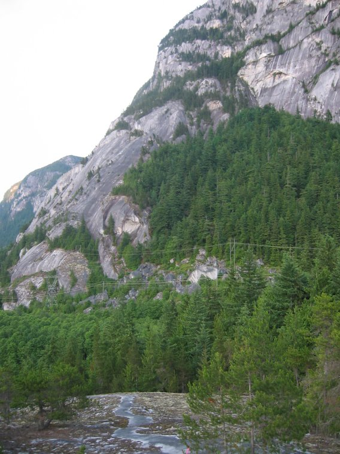
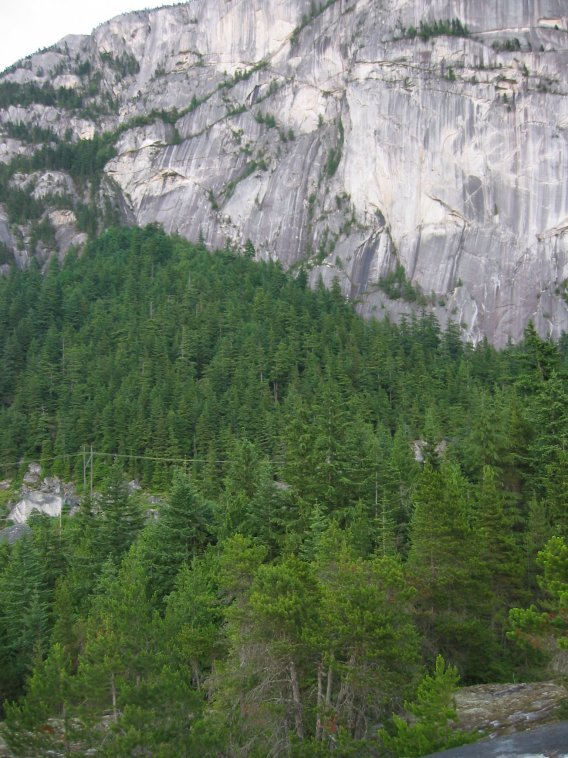
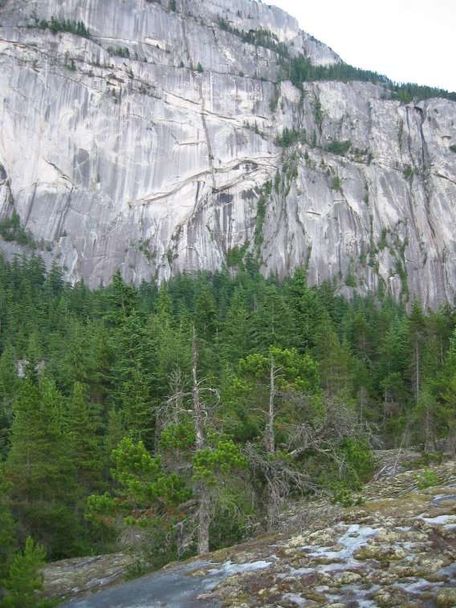
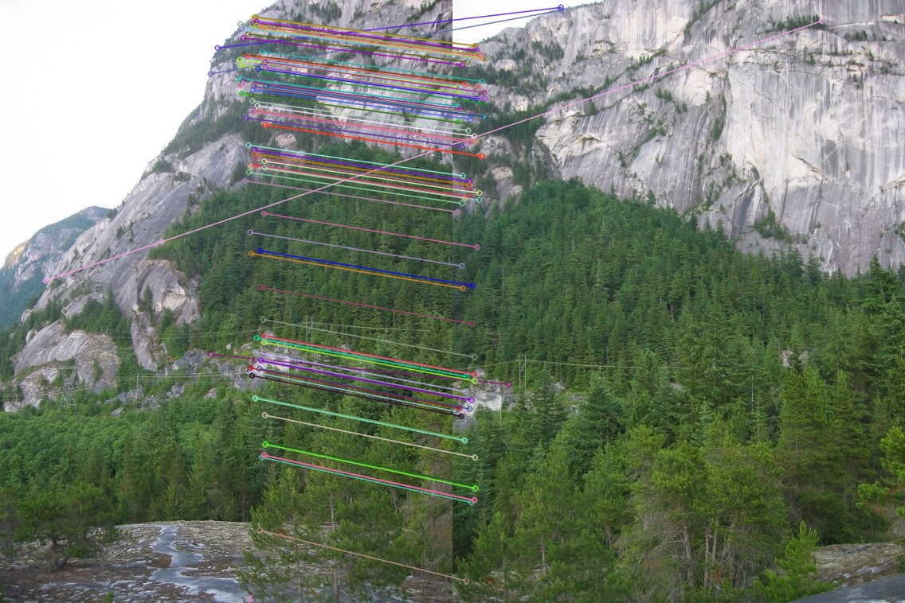
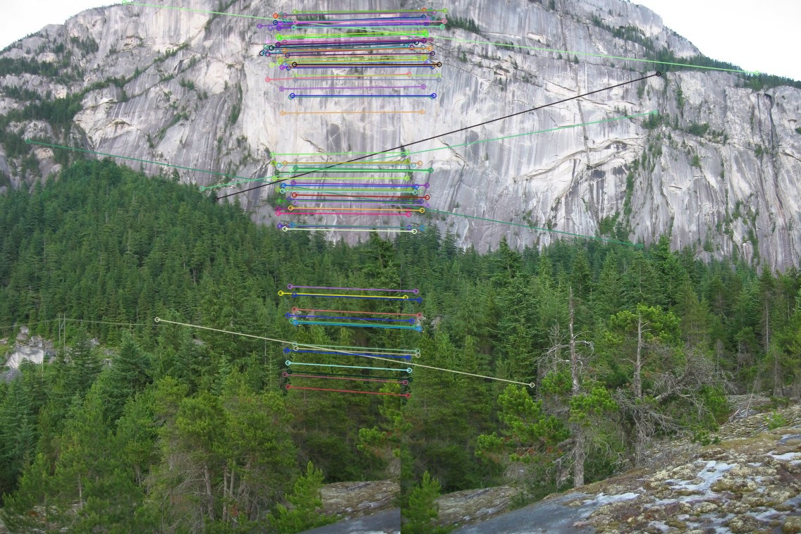
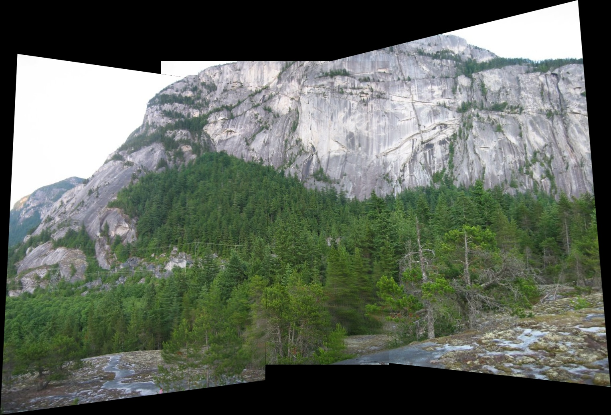

# Left_to_Right_ImageStitcher

3장의 겹치는 이미지를 이용하여 하나의 파노라마 이미지를 생성하는 OpenCV 기반 이미지 스티칭 프로그램입니다.

---

## 프로젝트 개요

본 프로그램은 특징점 기반 이미지 정합(Image Correspondence)을 이용하여  
서로 겹치는 3장의 이미지를 자동으로 정렬하고 하나의 이미지로 합성합니다.

---

## 구현 과정

### 입력 이미지

(출처 : CorentinBrtx / image-stitching https://github.com/CorentinBrtx/image-stitching/)

### 1. 특징점 검출 및 기술자 생성
각 이미지에서 SIFT를 이용하여 특징점(Keypoint)과 기술자(Descriptor)를 추출합니다.

### 2. 특징점 매칭
두 이미지 간의 특징점을 매칭하고, 임계값 이하의 잘못된 매칭을 제거합니다.

### 특징점 매칭 결과

### 3. RANSAC을 이용한 Homography 계산
매칭된 점들 중 이상치를 제거하고, 올바른 대응점(Inlier)을 기반으로 Homography 행렬을 계산합니다.

### 4. 이미지 정렬 (Warping)
계산된 Homography를 이용하여 좌측 이미지와 우측 이미지를 중앙 이미지 기준 좌표계로 변환합니다.

### 5. 캔버스 생성
모든 이미지가 포함될 수 있도록 전체 좌표 범위를 계산하여 캔버스를 생성합니다.

### 6. 이미지 합성 (Blending)
겹치는 영역은 Alpha Blending을 적용하여 자연스럽게 연결되도록 처리합니다.

---

## 결과

---

## 결론

- 세 이미지 간 충분한 overlap이 존재하여 안정적인 매칭이 이루어짐
- RANSAC을 통해 높은 비율의 inlier 확보
- 이미지 왜곡이 크지 않아 planar stitching이 잘 수행됨
- 간단한 blending을 통해 경계선이 비교적 자연스럽게 연결됨

---
